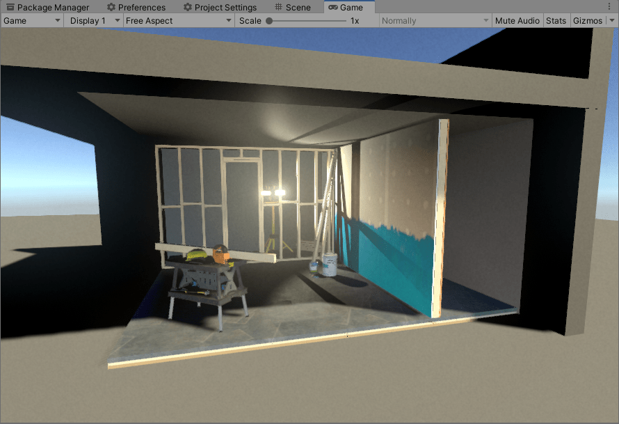
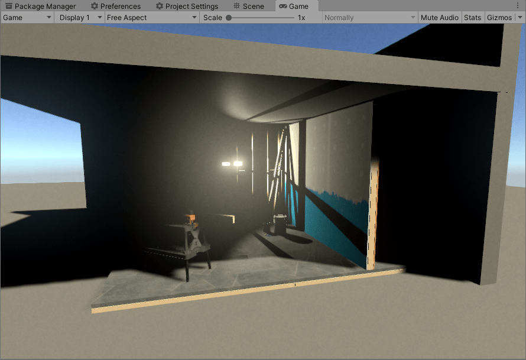
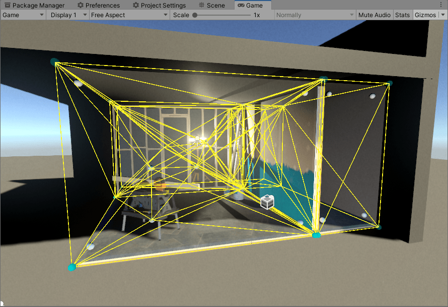
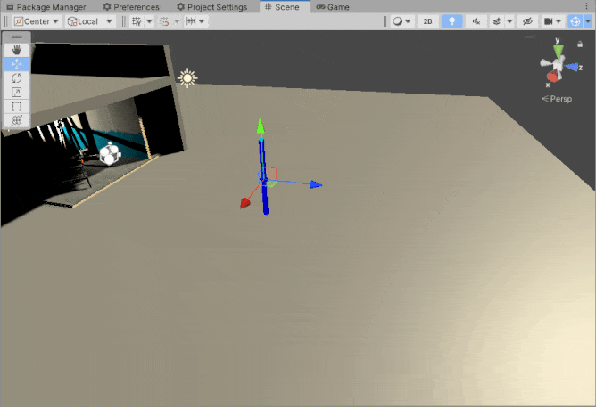
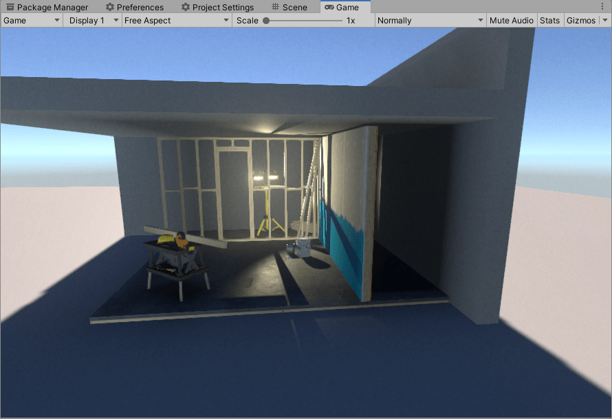
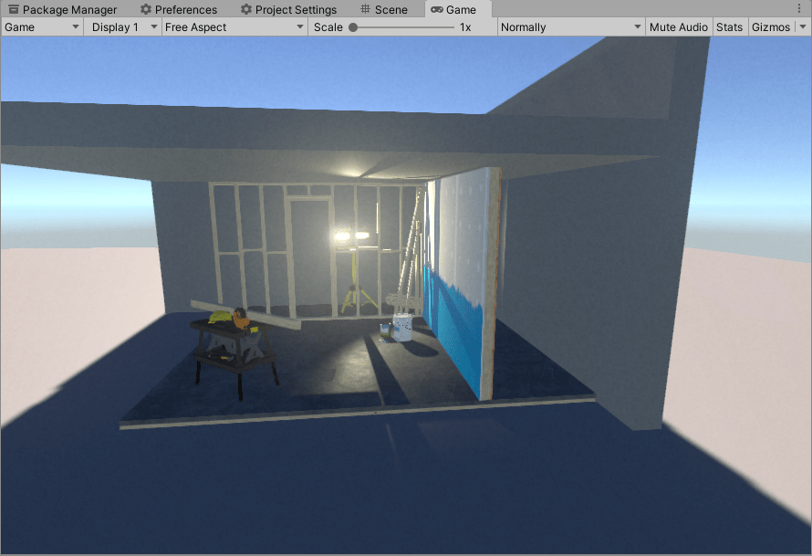
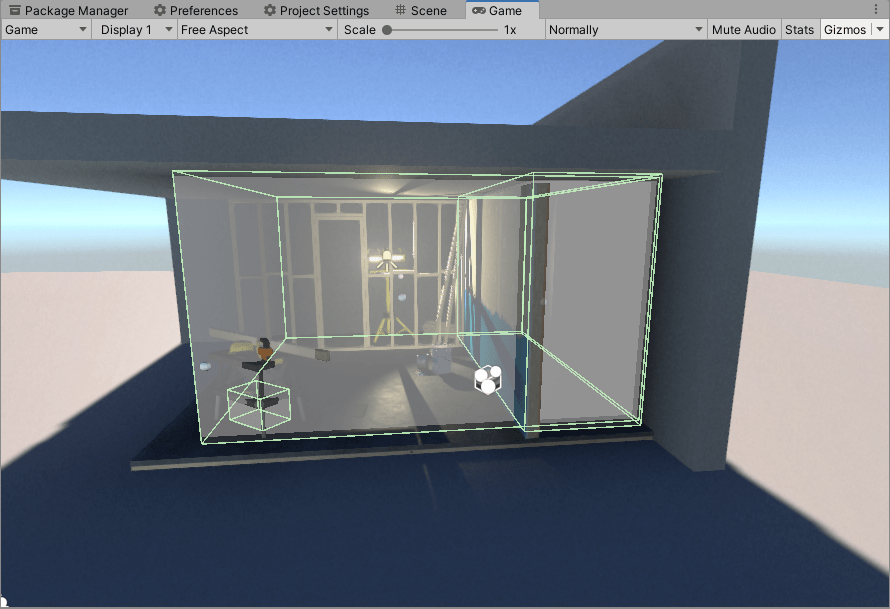
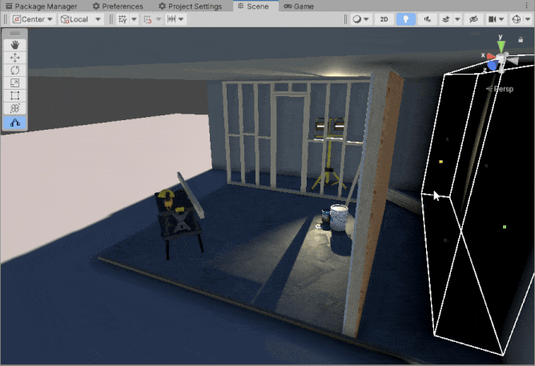
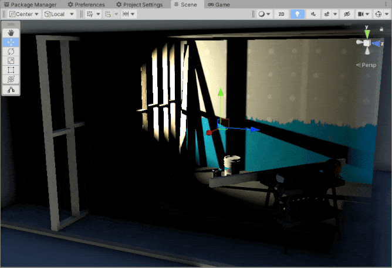
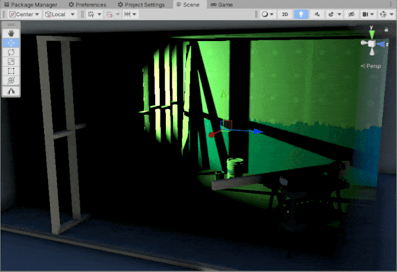

The stuff here is not production ready. I am just toying around and documenting some tests. 

My objective is to find a cheap, performant, decent looking, non-baked (or minimal baking) GI solution with low-end hardware and open-world games in mind.

## LightProbeGI

I always wanted to try out a tetrahedron-based gi solution. I also wanted to load in levels dynamically in-game, so I could not use Unity's tetrahedralizer (it only works in-Editor). I ended up having to implement my own Bowyer-Watson delaunay tetrahedralizer.

The shading works by interpolating on spherical harmonics (for each of the 4 vertices of tetrahedron). Baking is done using cubemap to sh code I found around (check Acknowledgements).

However it performs pretty bad on shading side. And also, the tetrahedralizer has floating-point issues, I tried using decimal and rational number libraries for better precision, but they perform super bad.

But even if it had good performance, the ease-of-use is bad. Essentially you have to put probe inside walls (to make it blend), and have their cubemap sample position outside the wall. Tweaking all of these things is a pain.

## SDFProbeGI

After trying out tetrahedron-based gi and getting disapointed overall, I wanted to try a cheaper, as-simple-as-it-gets, place-a-light-box solution. This one performs better, also looks better if tweaked right, and it is somewhat easier to use too.

It has 2 types of probes: occlusion and light. Occlusion probes occlude sky-light. Light probes produce fake local ambient light using spherical harmonics (pre-baked from cubemap).

It is as simple as just placing probes around to light the scene.

It mostly fits as a non-photorealistic but decent solution.

## Acknowledgements
TODO

## License
TODO